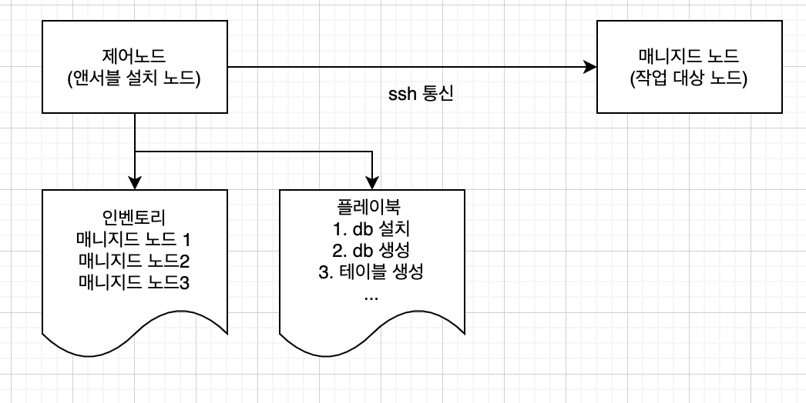
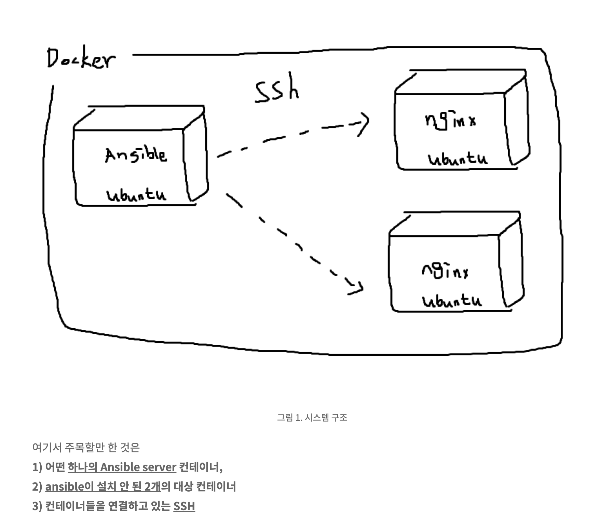

# 목차
[1. 개요](#1.개요)

[2. Ansible 사용법](#2.Ansible사용법)

[3. 자주 쓰는 명령어](#3.자주쓰는명령어)

[참고 link](#참고link)

[주의사항](#주의사항)

---
---


# 1. 개요


## 구조 & 작동 현황
```python
.
├── blk #정상작동
│   └── tasks
│       └── main.yaml
├── change_local.yaml
├── docker 
│   └── tasks
│       └── main.yaml
├── hostname #정상작동
│   └── tasks
│       └── main.yaml
├── image.png
├── lvm #정상작동
│   ├── tasks
│   │   └── main.yaml
│   └── vars
│       └── main.yaml
├── nas
│   ├── tasks
│   │   └── main.yaml
│   └── vars
│       └── main.yaml
├── playbook.yaml
└── README.md
```
 ##  설치 환경
OS : Ubuntu 16.04

대상 hosts: 
- lhj-lvm-test000 (ansibe svr) 
- lhj-lvm-test002 (node1) 10.0.200.7
- lhj-lvm-test003 (node2) 10.0.200.8


## 폴더 설명
task 별 폴더 생성
 - blk : 블록스토리지 생성
 - lvm : lv 생성
 - nas : nas 생성
 - hostname : hostname 변경
 - docker(미완) : 도커 설치 

- inspect(진행중): 취약점 점검 

    - [Testing Strategies](https://docs.ansible.com/ansible/latest/reference_appendices/test_strategies.html)




---
---

# 2. Ansible 사용법
## 1) ansible설치 (Ubuntu)

```
apt install ansible
```

## 2) (선택) SSH 키 설정

앤서블은 ssh로 제어 노드와 매니지드 노드가 연결된다. 작업을 진행하기 전에 authorized_keys에 키를 추가하여 주는 것이 좋다.
```python
 ssh-keygen -t rsa #키 생성
 ssh-copy-id root@ip #노드서버에 키 복사 
 ssh root@ip #ssh 연결
```

## 3) Inventory 설정
Ansible이 관리하는 서버의 정보를 담은 파일을 Inventory 파일이라고 하며 파일 위치는 /etc/ansible/hosts 
파일에 Remote Host IP 등록
```python
# vi /etc/ansible/hosts
[all:vars]
ansible_ssh_extra_args='-o StrictHostKeyChecking=no'

[server]
lhj-lvm-test002 ansible_host=10.0.200.7 ansible_ssh_user=root
lhj-lvm-test003 ansible_host=10.0.200.8 ansible_ssh_user=root
```
- ```StrictHostKeyChecking=no``` : ( 2.SSH 키 설정 - 하지 않은 경우 ) ssh를 이용해 원격에 있는 서버에 접근할 때 **로컬에 저장된 키가 서버의 키와 다르더라도 접속을 진행함**

관리노드와 연결 확인을 위한 Ping 테스트
```python
ansible server -m ping
```

## 4) Playbook 설정
ansible 실행에 필요한 Script를 정의한다. 기본적으로 하나의 playbook은 여러개의 task (**ansible 명령의 실행 단위)** 를 가진다.
```yaml
#playbook.yaml
---
- name: 이름
  hosts: 호스트들
  tasks:
  - name: 작업 1
    모듈:
      명령어: 명령
  - name: 작업 2
    모듈:
      명령어: 명령
```
-> 현재playbook.yaml파일은 ```roles:``` 를 이용
```yaml
#playbook.yaml
---
- hosts: all
  connection: local
  roles:
    - 작업1
    - 작업2
    - ...
    - lvm
```
```
├── lvm 
│   ├── tasks
│   │   └── main.yaml
│   └── vars
│       └── main.yaml
├── playbook.yaml
```
- roles모듈: 태스크(Task)를 묶어서 롤(Role)로 만들어 놓고 반복사용하는 형태로 구성할 수 있음.
roles 폴더 내부에 구성요소들(tasks, vars) 있으면 자동으로 main.yaml읽어서 사용할 수 있다.

## 5) Playbook 실행
Inventory, Playbook 구성이 완료되었으면 Ansible을 실행할 차례
```
ansible-playbook playbook.yaml
```

# 3. 자주 쓰는 명령어
관리하는 노드 전체에 같은 명령어: ```ansible all -m shell -a "df -h" -k```

---
---


# 참고 link
official
- [모듈 docs](https://docs.ansible.com/ansible/latest/collections/ansible/builtin/index.html)

기타
- [개발자가 ansible 시작하기](https://wikidocs.net/130112)

# 주의사항
- 제어 노드는 Linux 나 Unix만 지원  (리눅스 기반 / window, macOS는 ansible 사용불가)
- ssh 기반으로 동작하기 때문에 에이전트를 설치할 필요 없이 ssh 접속 정보만을 주면 된다 (/etc/ansible/hosts 에 작성)


