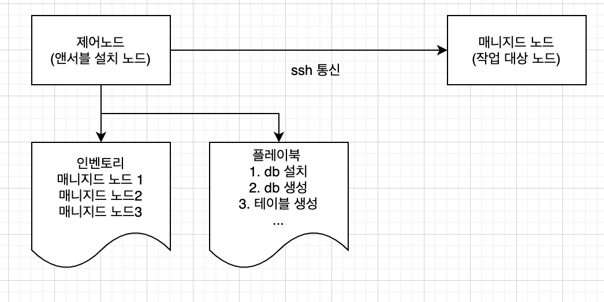

# 개요


# 작동 현황
```python
.
├── blk #정상작동
│   └── tasks
│       └── main.yaml
├── change_local.yaml
├── docker 
│   └── tasks
│       └── main.yaml
├── hostname #정상작동
│   └── tasks
│       └── main.yaml
├── image.png
├── lvm #정상작동
│   ├── tasks
│   │   └── main.yaml
│   └── vars
│       └── main.yaml
├── nas
│   ├── tasks
│   │   └── main.yaml
│   └── vars
│       └── main.yaml
├── playbook.yaml
└── README.md
```

## 파일 설명
- inspect: 취약점 점검 

    - [Testing Strategies](https://docs.ansible.com/ansible/latest/reference_appendices/test_strategies.html)

## 주의사항
- 제어 노드는 Linux 나 Unix만 지원 


# docs
- 모듈 docs : https://docs.ansible.com/ansible/latest/collections/ansible/builtin/index.html


